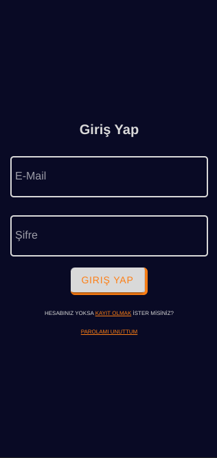

  # [BurçGer ۞](https://github.com/)
  **A cross-platform mobile application written in Angular and Ionic for zodiac and zodiac interpretations.**

<h2 align="center">BurçGer</h2>

<h3 align="center">Login page</h3>

<h3 align="center">My Account Page</h3>

<h3 align="center">User and Creator Comments Page</h3>

<h3 align="center">Creators Page</h3>

<h3 align="center">Admin Panel</h3>

<h3 align="center">And More...</h3>

<table align="center">
  <tr>
    <td valing="center" width="70%">The part where it is located and the work it does.</td>
    <td valing="center" width="30%">The person who did it.</td>
  </tr>
  <tr>
    <td>Login, Register and Profile pages (Auth and User data secure)</td>
    <td><a href="https://github.com/elif077">BIG RED BUTTON
    </a>
    </td>
  </tr>
  <tr>
    <td>User/Creator interface pages(Home, Comments...)</td>
    <td><a href="https://github.com/Hakanbaban53">Hakanbaban53
    </a>
    </td>
  </tr>
  <tr>
    <td>Admin panel(Add comment, Edit User's varible ...)</td>
  <td><a href="https://github.com/feridunakyurek">Village BOY
  </a>
  </td>
  </tr>
  <tr>
    <td>Project Manager(Create the project, Review the Pull Request ...)</td>
    <td><a href="https://github.com/berkeercetin">Mr. lonely
    </a>
    </td>
  </tr>
</table>

